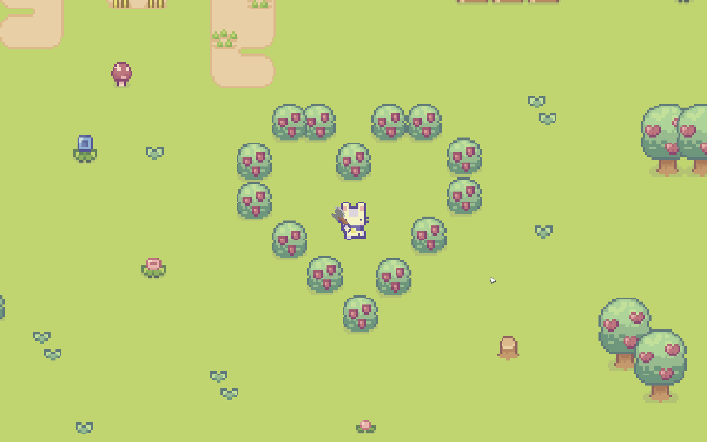

###### <i>Catisle</i> start scene
# Catisle

Welcome to *Catisle*! A 2D, top-down, life simulator where you're a cat!
This game is sadly unfinished, but thankfully has given me tons of motivation to keep working on it.
Made in GameMaker! :]

## How to play

**Movement:** WASD or arrow keys

**Damaging:** Left-mouse click

There isn't much to the game as of now.. what you can do, is below in [features](#features).

## Features

* [x] Walk around the map
* [x] Break bushes and trees
* [x] Pick up wood drops from bushes and trees
* [x] Kill a cow for milk

## Roadmap

* [ ]  Fix cosmetic bugs
* [ ]  Add plants that can be [planted & harvested](https:/www.youtube.com/watch?v=UC3G-lfnBvA&list=PLSFMekK0JFgzbFfj1vAsyluKTymnBiriY&index=9)
* [ ]  Add an inventory
* [ ]  Add dialogue
* [ ]  Create a player tutorial
* [ ]  Adding a [save system](https://www.youtube.com/watch?v=i6aEyrRIzTY)
* [ ]  Design two cats that resemble mine

### Acknowledgements

* [<strong>GameMaker Station - Matharoo</strong> – Crafting Game Tutorial](https://www.youtube.com/playlistlist=PLUEcBPiXnlBwNjhLWzJAQJ78deyXRIIZl)
* [<strong>Sprout Lands</strong> – Game Assets Pack](https://cupnooble.itch.io/sprout-lands-asset-pack)
* [<strong>Sprout Lands</strong> – Game UI Pack](https:/cupnooble.itch.io/sprout-lands-ui-pack)
* [Game Maker Documentation](https://manual.gamemaker.io/monthly/en/#t=Content.htm)