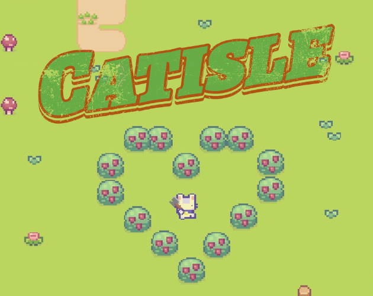
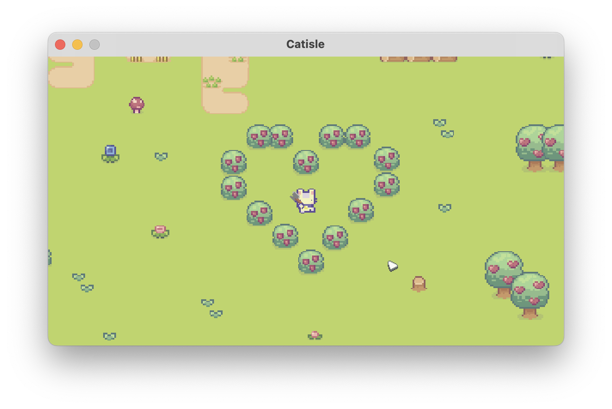
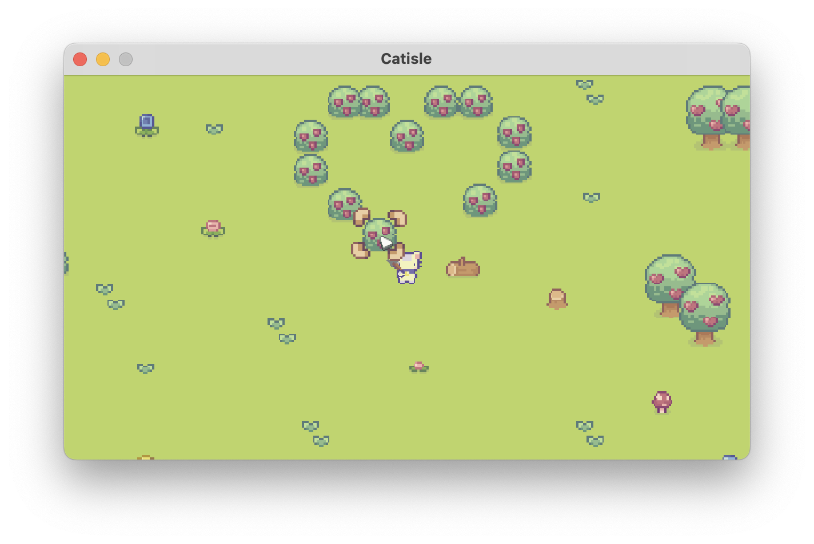
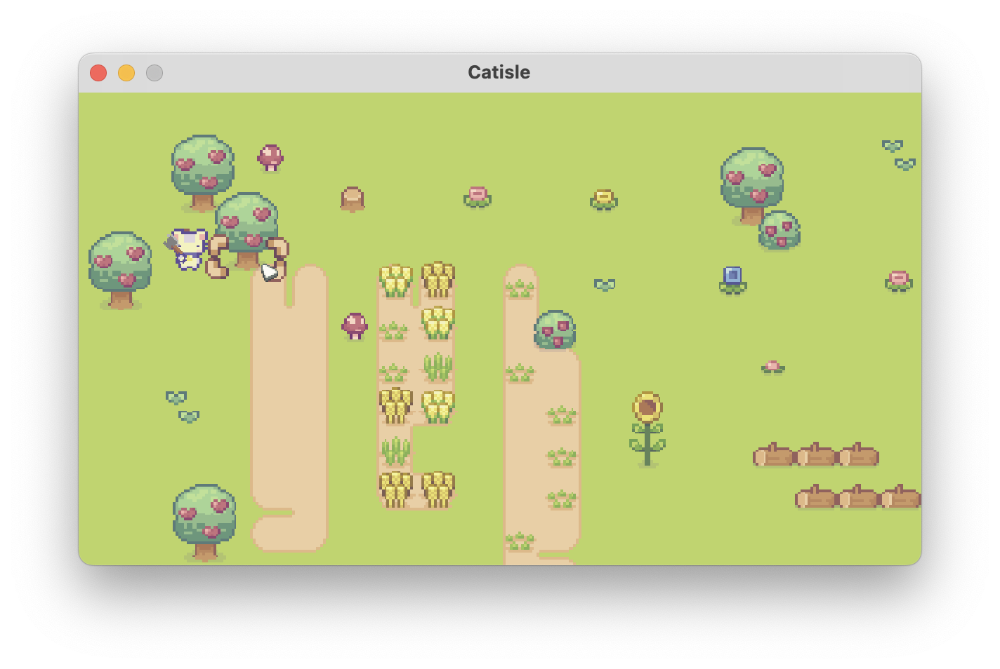
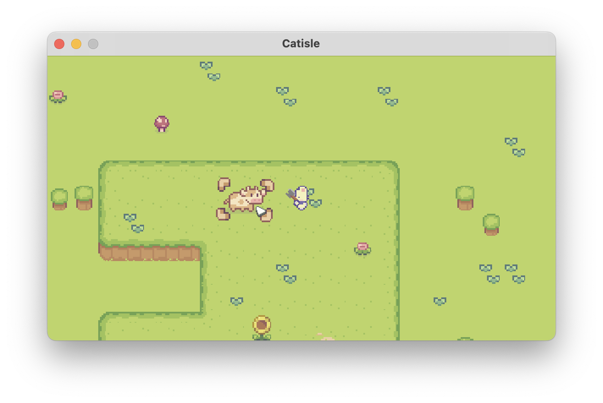

<!-- UPDATED Jan. 15, 2025 -->

# 🌾 Catisle *(2D)*

Be a farmer cat in this 2D, cozy, top-down life simulator. ⋆ ⟡🌾⊹⋆˙🐈⟡ ⋆.🪵˚ ⊹₊🪓⟡ ⋆

***Catisle*** currently has: player movement, world interaction/manipulation, item collection, and an explorable map. 
Made in GameMaker! :]

<!--Project version, tech stack-->

<a href="https://github.com/Jenspi/catisle/releases">

 
<!--
-->
 

## 📋 Table of Contents

- [🌾 Catisle *(2D)*](#-catisle-2d)
  - [📋 Table of Contents](#-table-of-contents)
  - [❣️ Features](#️-features)
  - [🕹️ Controls](#️-controls)
  - [🪓 Demo (Play for Yourself!)](#-demo-play-for-yourself)
  - [📦 Screenshots](#-screenshots)
  - [🗺️ Roadmap](#️-roadmap)
  - [🙇‍♀️ Acknowledgements](#️-acknowledgements)
        - [*Last updated: Jan. 15, 2026*](#last-updated-jan-15-2026)

## ❣️ Features

**🧭 Exploration** 
Explore a small, custom-made map 
Find and collect resources 

**🌱 Farming** 
Deforest your land and collect logs 
Kill your beloved cow for milk

**🆓 FREE to Play** 
No ads or micro-transactions 
Perfect for fans of Stardew Valley 

<i><a href="#readme-toc">(back to table of contents)</i></a>

## 🕹️ Controls

Run around the map and explore what I have implemented thus far!

`WASD / arrow keys` → Move 
`Mouse Left-click` → Damage highlighted items 

## 🪓 Demo (Play for Yourself!)

**PLAY Catisle for free on itch.io!** 

 

Please leave it a <b>rating and/or comment</b> while you're there! It would mean the world to me! 🌎❣️

<i><a href="#readme-toc">(back to table of contents)</i></a>

## 📦 Screenshots

<i>Starting point– blocked player in so they discover world interaction (v0.1.0-alpha)</i>

<i>World interaction/manipulation (v0.1.0-alpha)</i>

<i>Cow. Can be killed for 1 milk. (v0.1.0-alpha)</i>

<i><a href="#readme-toc">(back to table of contents)</i></a>

<!-- TODO: add alt tags to photos -->

## 🗺️ Roadmap

* [x] Walk around the map
* [x] Break bushes and trees
* [x] Pick up wood drops from bushes and trees
* [x] Kill a cow for milk
* [ ]  Add music
* [ ]  Fix cosmetic bugs
* [ ]  Try out different game window dimensions
* [ ]  Add plants that can be [planted & harvested](https:/www.youtube.com/watch?v=UC3G-lfnBvA&list=PLSFMekK0JFgzbFfj1vAsyluKTymnBiriY&index=9)
* [ ]  Add an inventory
* [ ]  Add dialogue
* [ ]  Create a player tutorial
* [ ]  Adding a [save system](https://www.youtube.com/watch?v=i6aEyrRIzTY)
* [ ]  Design two cats that resemble mine
* [ ]  Add ability to plant things (crops, flowers, grass) to cultivate biodiversity
* [ ]  Add skills system
* [ ]  Add ability to build (farm plots, fences, habitats, etc)
* [ ]  Add terraforming (build ponds, irrigation, etc)
* [ ]  Add ability to raise animals
* [ ]  Add a crafting system for using resources collected

<i><a href="#readme-toc">(back to table of contents)</i></a>

## 🙇‍♀️ Acknowledgements

* [<strong>GameMaker Station - Matharoo</strong> – Crafting Game Tutorial](https://www.youtube.com/playlistlist=PLUEcBPiXnlBwNjhLWzJAQJ78deyXRIIZl)
* [<strong>Sprout Lands</strong> – Game Assets Pack](https://cupnooble.itch.io/sprout-lands-asset-pack)
* [<strong>Sprout Lands</strong> – Game UI Pack](https:/cupnooble.itch.io/sprout-lands-ui-pack)

##### *Last updated: Jan. 15, 2026*